<div align="center">


# ⚡ Scraper Studio

**A powerful, browser-based web scraper with a DevTools-style DOM picker, click-to-inspect, live preview, and smart data cleaning. No backend. No API keys. Just open and scrape.**

[Features](#-features) · [Screenshots](#-screenshots) · [Getting Started](#-getting-started) · [How to Use](#-how-to-use) · [Project Structure](#-project-structure)

---

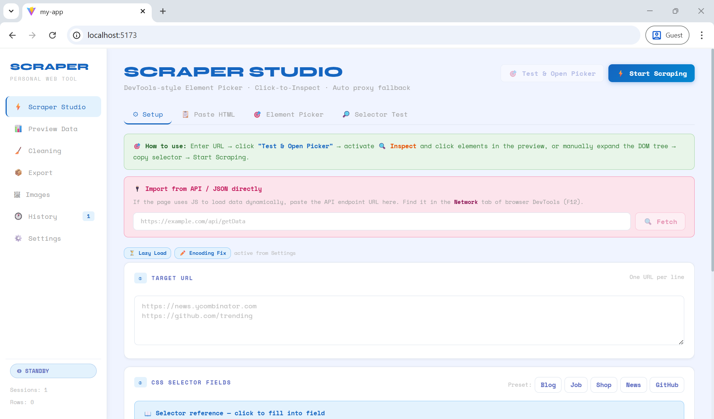

</div>

---

## ✨ Features

### 🎯 Smart Element Picker
- **DevTools-style DOM tree** — browse the full page structure in a resizable split-pane
- **Click-to-Inspect** — click any element in the live preview to jump directly to it in the tree
- **Auto CSS selector generation** — smart, minimal selectors using IDs, data attributes, and class names
- **Column targeting** — automatically detects `<table>` elements and generates precise `td:nth-child(n)` selectors
- **Live match counter** — see how many elements your selector matches in real time

### 🌐 Multi-Proxy Fetching
- Automatically cycles through 6 public CORS proxies (corsproxy.io, allorigins, codetabs, and more)
- **Wikipedia fast path** — direct API access for all Wikipedia pages
- **Cloudflare detection** — identifies JS challenge pages and warns before wasting time
- **Encoding repair** — re-fetches raw bytes for non-UTF-8 pages (Japanese, Chinese, Eastern European)

### 📋 Paste HTML Mode
- Paste raw HTML from `Ctrl+U → View Source` and scrape it locally — no network needed
- Full DOM picker and selector testing on pasted content

### 🔌 API / JSON Import
- Auto-detects hidden API endpoints from `fetch()`, `axios`, and XHR calls in JS bundles
- Detects GraphQL endpoints
- Direct JSON endpoint fetcher with auto table-structure detection

### 📊 Data Preview & Inline Editing
- Full table view with toggleable columns
- Double-click any cell to edit inline
- Double-click headers to rename columns

### 🧹 Data Cleaning
- **Live preview** shows before/after for every operation
- Remove duplicates · Trim whitespace · Strip HTML tags
- Lowercase / Uppercase / Capitalize
- Extract numbers only · Extract URLs only

### 📦 Export
- **CSV, JSON, Excel (.xls)** — for scrape results
- **Links JSON/CSV** — all links found on the page
- **Images JSON/CSV** — all images with alt text

### 🖼 Images Tab
- Grid or list view of all scraped images
- Filter by URL or alt text · Copy URL · Open in new tab

### 🕐 History
- Auto-saves every scrape session to localStorage
- Load, export, or delete past sessions

### ⚙️ Settings
- 16 toggleable features organized into 5 sections: Core Engine, Dynamic Content, Security/Session, Advanced Extraction, Anti-Bot & Shield Bypass
- Anti-Bot Mode: rotating User-Agent, browser-realistic headers, bimodal human delays
- CSRF token extraction · ASP.NET ViewState extraction · Cookie persistence · Shadow DOM scraping

---

## 📸 Screenshots

### Setup — Enter URLs & Define Fields
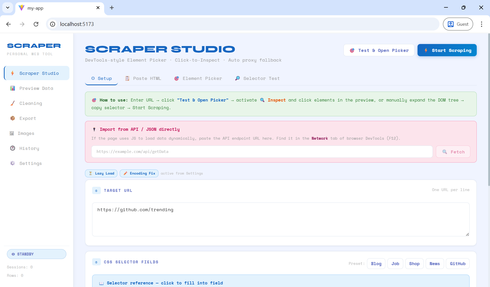

---

### CSS Selector Fields & Presets
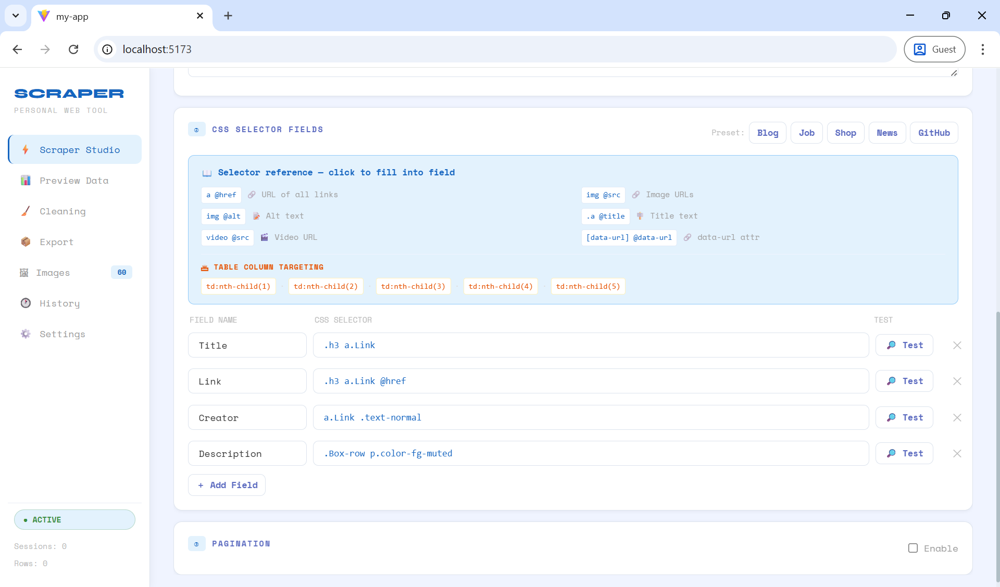

---

### Element Picker — Click-to-Inspect with Live Preview
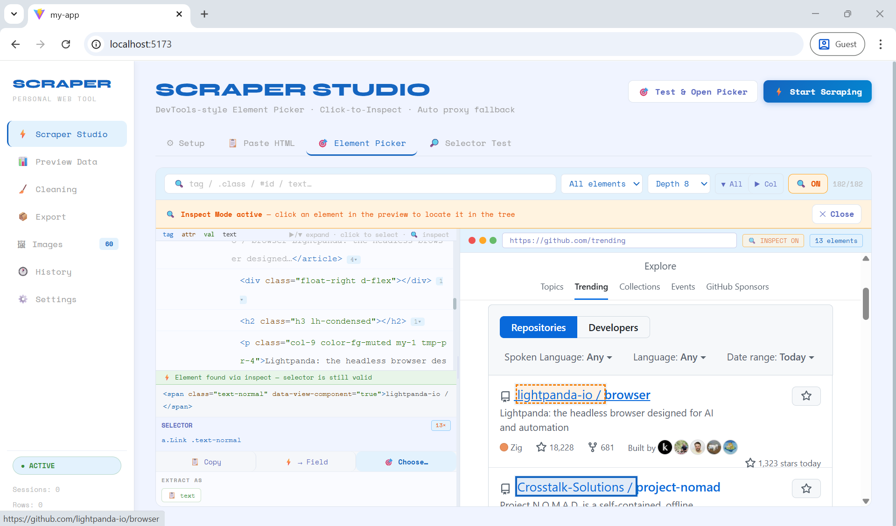

---

### Paste HTML Mode — Scrape Without Network
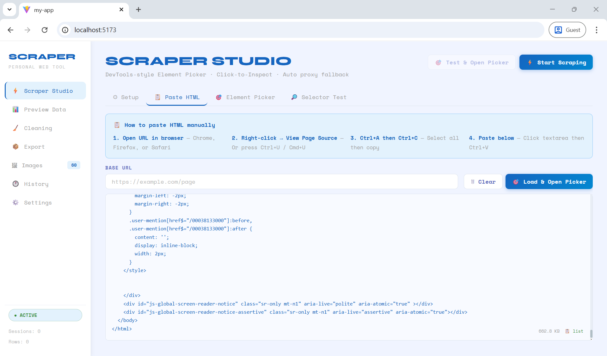

---

### Selector Test — Validate Selectors Instantly
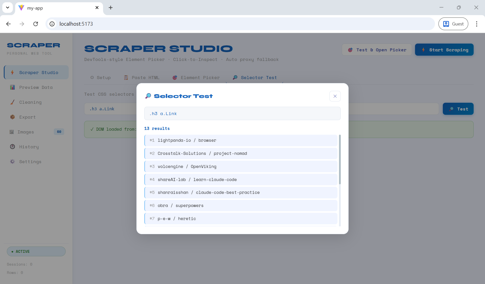

---

### Preview Data — Inline Editing & Column Toggle
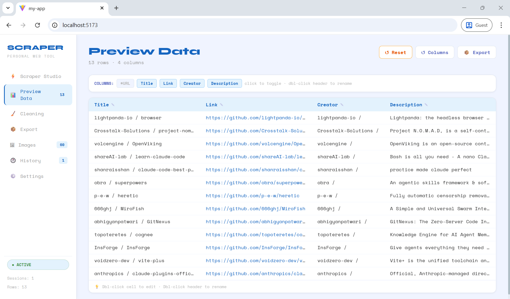

---

### Data Cleaning — Live Before/After Preview
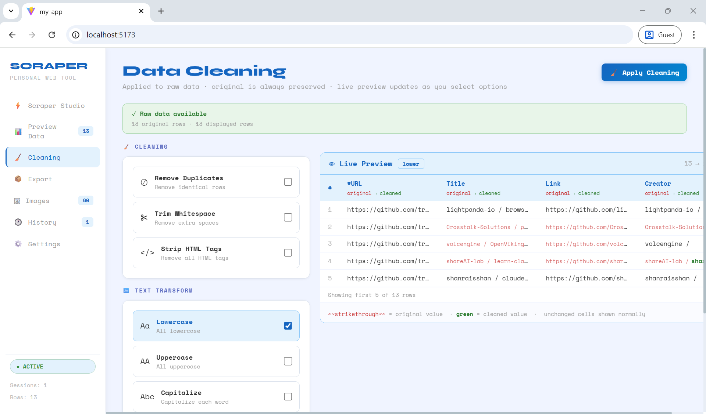

---

### Export — CSV / JSON / Excel / Links / Images
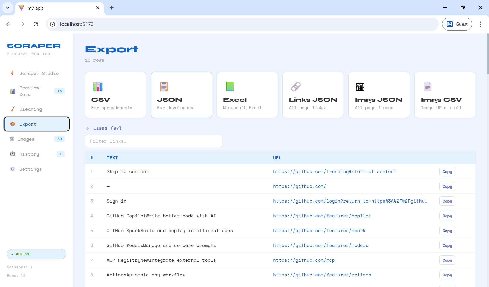

---

### Images Tab — Grid View with Filter
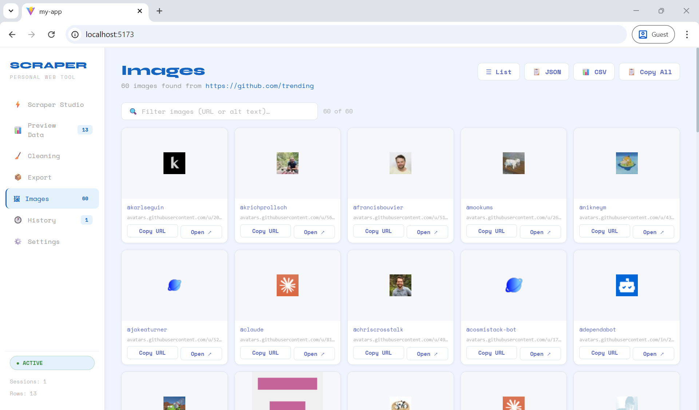

---

### History — Session Management
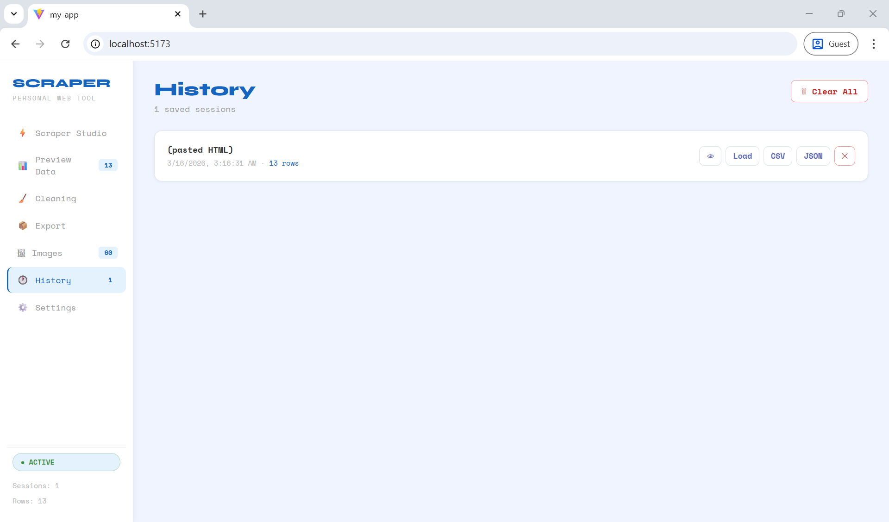

---

### Settings — 16 Feature Toggles
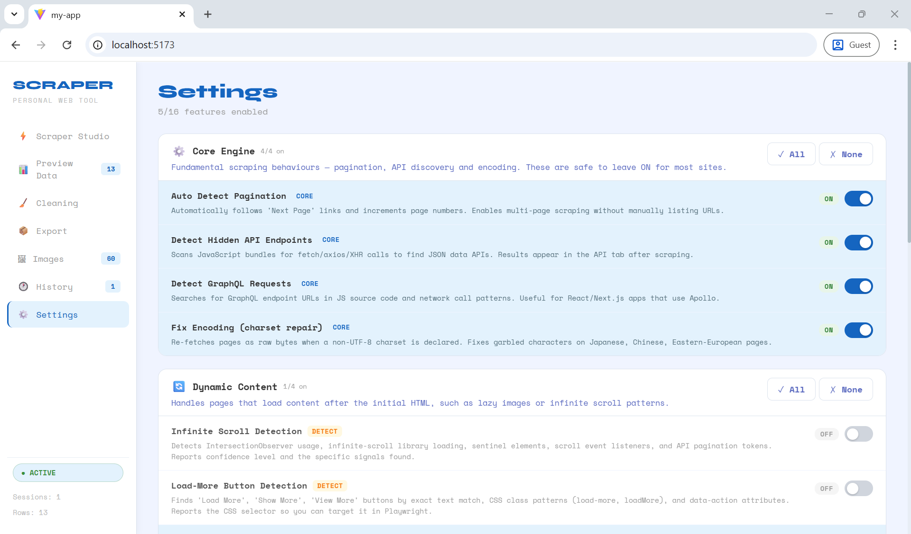

---

## 🚀 Getting Started

### Prerequisites
- Node.js 18+
- npm or yarn

### Installation

```bash
# Clone the repository
git clone https://github.com/adin-alxndr/scraper-studio.git
cd scraper-studio

# Install dependencies
npm install

# Start the development server
npm run dev
```

Open [http://localhost:5173](http://localhost:5173) in your browser.

### Build for Production

```bash
npm run build
npm run preview
```

---

## 🛠 How to Use

### Basic Scraping in 4 Steps

**1. Enter a URL**
Paste one or more URLs (one per line) in the **Target URL** field.

**2. Open the Element Picker**
Click **"Test & Open Picker"** to fetch the page and open the live DOM tree.

**3. Pick your selectors**
- Activate **🔍 Inspect** and click elements directly in the preview pane
- Or browse the DOM tree manually and click any node to select it
- Use the **"Choose…"** button to assign the selector to a field

**4. Start Scraping**
Click **⚡ Start Scraping** — results appear in **Preview Data**.

### Scraping Tables Automatically

When a `<table>` is detected on the page, click **⚡ Auto-fill All Columns** in the setup tab. The tool will generate a field per column with precise `td:nth-child(n)` selectors instantly.

### Using Paste HTML Mode

If a site blocks bots:
1. Open the page in your browser
2. Press `Ctrl+U` to view source
3. `Ctrl+A` → `Ctrl+C` to copy
4. Switch to the **Paste HTML** tab → paste → **Load & Open Picker**

### Selector Syntax Reference

| Selector | What it extracts |
|---|---|
| `h1` | Text content of `<h1>` |
| `.price` | Text of elements with class `price` |
| `a @href` | `href` attribute of all `<a>` tags |
| `img @src` | `src` attribute of all images |
| `img @alt` | `alt` text of images |
| `table tbody tr td:nth-child(2)` | Second column of a table |
| `[data-id] @data-id` | Any custom `data-*` attribute |

---

## 📁 Project Structure

```
src/
├── App.jsx      # Root component that composes the main UI
├── main.jsx     # Vite entry point that mounts the React application
├── index.css    # Global styles and base typography
├── App.css      # Component-level styles for the main app layout
│
├── hooks/
│   ├── useToast.js            # Toast notification state
│   ├── useHistory.js          # Session history + localStorage
│   ├── useFields.js           # Scrape field definitions
│   ├── usePageData.js         # Fetched DOM, links, images, endpoints
│   ├── useResults.js          # Result table + cleaning state
│   ├── useScraperSettings.js  # Settings + localStorage persistence
│   ├── useScrapeSession.js    # URL input, pagination, progress
│   └── useScraperActions.js   # testLoad, runScrape, importApiData, …
│
├── tabs/
│   ├── ScrapeTab.jsx          # New Scrape (Setup, Paste HTML, Picker, Test)
│   ├── ResultTab.jsx          # Preview Data table
│   ├── CleanTab.jsx           # Data Cleaning + live preview
│   ├── ExportTab.jsx          # Export CSV/JSON/Excel/Links/Images
│   ├── ImagesTab.jsx          # Images grid/list
│   └── HistoryTab.jsx         # Session history
│
├── components/
│   ├── ui/index.jsx           # Primitives: Btn, Card, Toast, Badge, …
│   ├── Sidebar.jsx            # Navigation sidebar
│   ├── DomPicker.jsx          # DOM tree + resizable split pane
│   ├── PreviewPane.jsx        # Sandboxed iframe + inspect bridge
│   ├── HtmlLine.jsx           # Syntax-highlighted DOM node row
│   ├── FieldPickerModal.jsx   # Insert selector into field
│   ├── SelectorTestPanel.jsx  # Live selector test modal
│   ├── HistoryModal.jsx       # Session preview modal
│   ├── CleanPreview.jsx       # Before/after cleaning table
│   ├── JsChallengeWarning.jsx # Cloudflare warning banner
│   ├── SettingsPage.jsx       # 16-toggle settings page
│   └── AntiBotReportModal.jsx # Browser fingerprint report
│
└── utils/
    ├── proxies.js             # PROXIES list, fetchWithFallback, fetchJsonViaProxy
    ├── cloudflare.js          # Cloudflare / JS challenge detection
    ├── encoding.js            # Charset detection & re-fetch
    ├── cookies.js             # Session cookie store
    ├── antiBot.js             # UA rotation, browser headers, delays, fingerprint report
    ├── domExtract.js          # extractByCss, Shadow DOM, CSRF, tables, JSON flatten
    ├── domDetect.js           # detectInfiniteScroll, detectLoadMoreButtons, pagination, GraphQL
    ├── domSelector.js         # buildTreeNode, buildElSelector, flattenVisible, …
    ├── apiSniff.js            # sniffApiEndpoints from JS bundles
    ├── dataClean.js           # applyCleaningOps, dlCSV, dlJSON, dlXLS
    ├── presets.js             # Field presets (Blog, Job, Shop, News, GitHub)
    └── settings.js            # DEFAULT_SETTINGS, SETTING_META, BADGE_COLORS
```

---

## 🔧 Tech Stack

| | |
|---|---|
| **Framework** | React 18 + Vite |
| **Styling** | Plain CSS variables — zero UI library dependencies |
| **State** | Custom hooks only — no Redux, no Zustand |
| **Storage** | `localStorage` for history, settings, and cookies |
| **Proxies** | corsproxy.io · allorigins · codetabs · crossorigin.me · cors.sh |
| **DOM parsing** | Native browser `DOMParser` |

---

## ⚠️ Known Limitations & What's Already Handled

These are architectural constraints of a fully browser-based tool. The good news: the **Settings page already has a dedicated UI** for each of these — toggle them on and the tool does everything it *can* do within browser constraints. The rest is open for you to extend via fork.

| Limitation | What the Settings UI already does | What still requires a real browser |
|---|---|---|
| **JavaScript-rendered pages** | **Lazy Image Loading** swaps `data-src` → `src` before extraction. **Shadow DOM Scraping** traverses declarative shadow roots and JSON script blocks. **Paste HTML** tab lets you load `Ctrl+U` source directly — no network needed. | Full JS execution (React hydration, `fetch()` calls after load, scroll-triggered renders) — needs Playwright/Puppeteer |
| **Cloudflare / bot-protected sites** | **Anti-Bot Mode** rotates User-Agents (Chrome/Firefox/Edge/Safari), injects full browser headers (`Sec-Fetch-*`, `Sec-CH-UA`), adds bimodal human-like delays (1.5–9s), and manages a per-domain cookie jar. **Cloudflare Detection** identifies challenge pages early and returns partial data with a clear warning instead of silently failing. | CAPTCHA solving and real JS challenge pages — needs a stealth headless browser (e.g. Playwright + stealth plugin) |
| **Infinite scroll / Load More** | **Infinite Scroll Detection** scans for `IntersectionObserver`, scroll event listeners, sentinel elements, and known library signatures — reports confidence score and exact signals found. **Load-More Button Detection** finds buttons by text, CSS class, and `data-action` patterns — reports the CSS selector ready for use in Playwright. | Actually triggering the scroll or click to load more content — needs a real browser |

> 💡 In short: the Settings page gives you **full visibility and reporting** on all three limitations. You always know *what* is blocking you and *why* — the tool never silently fails.

---

## 🍴 Fork & Extend

This project is intentionally structured to be easy to extend. The codebase is fully modular:

```
hooks/          ← add new state or async logic here
utils/          ← add new detection, parsing, or fetch strategies here
tabs/           ← add a new page-level tab here
components/     ← add new UI components here
```

**Some ideas for what you could build on top:**

- 🤖 **Playwright bridge** — add a local WebSocket server that receives scrape jobs and executes them in a real browser, then sends results back to the UI
- 🔁 **Scheduled scraping** — add a cron-style scheduler using `setTimeout` chains and browser notifications
- 🧠 **AI field detection** — use an LLM to auto-suggest CSS selectors from a page description
- 🗄️ **Database export** — add SQLite/IndexedDB storage instead of localStorage, or a direct export to Supabase/Airtable
- 🌍 **Multi-language support** — the UI strings are scattered in JSX; centralizing them into a `i18n/` module would enable translations

To get started:

```bash
# Fork the repo on GitHub, then:
git clone https://github.com/adin-alxndr/scraper-studio.git
cd scraper-studio
npm install && npm run dev
```

Contributions, issues, and feature requests are welcome. If you build something cool on top of this, feel free to open a PR or share it in Discussions.

---

## 📄 License

MIT — free to use, modify, and distribute.

---

<div align="center">
  Built with ⚡ by a developer who got tired of setting up Scrapy for simple tasks.
  <br/><br/>
  If this saved you time, consider starring the repo ⭐
</div>
